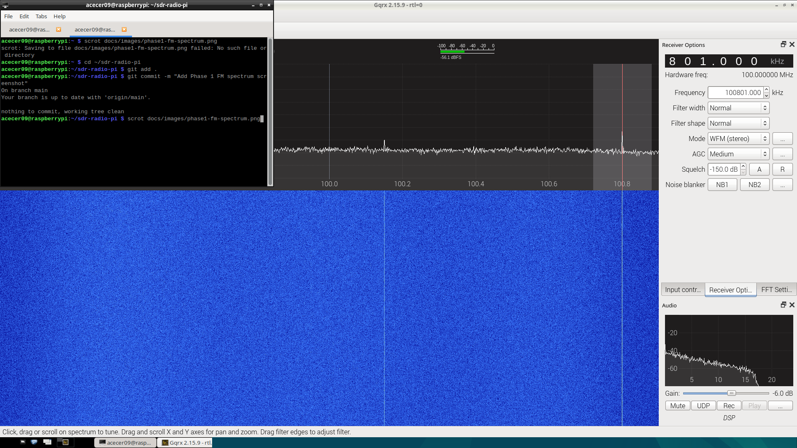
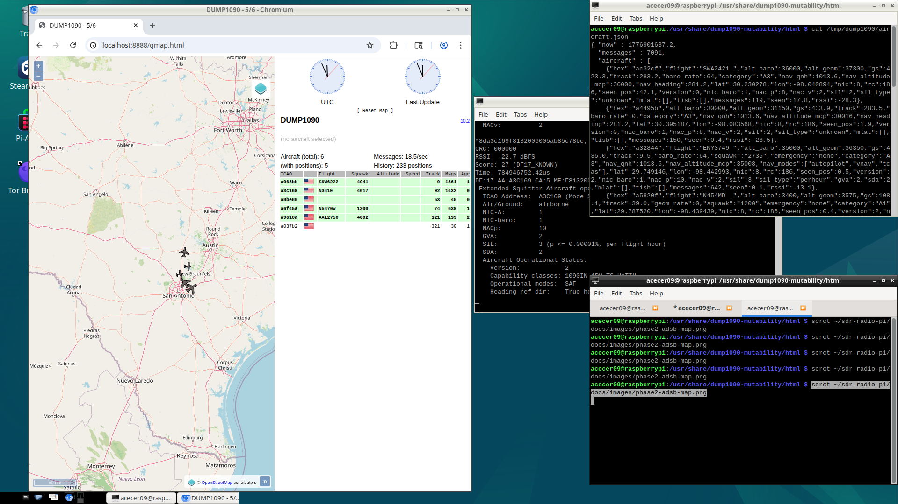
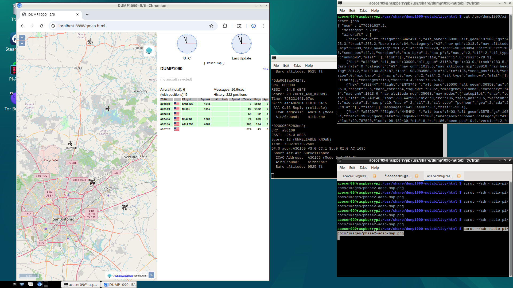
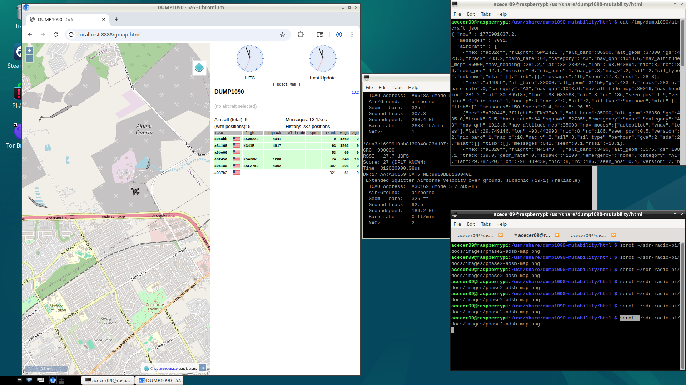

# Raspberry Pi SDR Radio Station

A software-defined radio system built on a Raspberry Pi 5 that receives and decodes
real-world radio signals — from FM broadcasts to live weather satellite imagery from orbit.

## What it does

- 📻 **Phase 1 — FM Radio:** Tunes and plays live FM stations using a $30 USB dongle
- ✈️ **Phase 2 — Aircraft Tracking:** Decodes ADS-B signals to map live flights overhead
- 🛰️ **Phase 3 — ISS Image Reception:** Receives and decodes SSTV images transmitted from the International Space Station
- 🌐 **Phase 4 — Web Dashboard:** Live web interface showing spectrum, flights, and satellite images

## Hardware

| Part | Cost |
|------|------|
| Raspberry Pi 5 | ~$80 |
| RTL-SDR Blog V4 dongle | ~$30 |
| Telescoping antenna (included) | — |

## Project structure sdr-radio-pi

## Progress

- [x] Phase 1 — FM Radio
- [x] Phase 2 — ADS-B Aircraft Tracking
- [ ] Phase 3 — ISS Image Reception
- [ ] Phase 4 — Web Dashboard
## Phase 1 results

Live FM spectrum captured in San Antonio,TX. Each spike is a different radio station broadcasting in the 88-108 MHz band.

## Phase 2 results

Live ADS-B aircraft tracking over San Antonio, TX. Flight data decoded directly from aircraft transponders at 1090 MHz.

## Key concepts

This project covers core ECE topics including analog-to-digital conversion, IQ sampling,
FM demodulation, digital packet decoding, signal processing with FFT, and orbital mechanics
for ISS pass prediction, and SSTV image decoding.

## About

Built by Alex Cervantes as an independent engineering project. Currently in progress.

